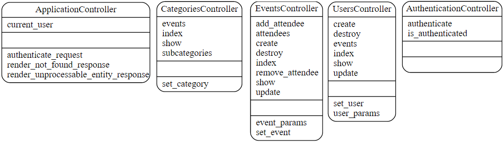
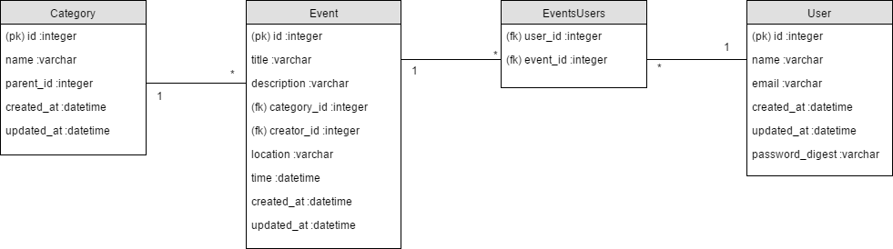

# Data model

## Controllers


## Database tables


## Schema
```ruby
ActiveRecord::Schema.define(version: 20170327170937) do

  create_table "categories", force: :cascade do |t|
    t.string   "name"
    t.integer  "parent_id"
    t.datetime "created_at", null: false
    t.datetime "updated_at", null: false
  end

  create_table "events", force: :cascade do |t|
    t.string   "title"
    t.string   "description"
    t.integer  "category_id"
    t.integer  "creator_id"
    t.string   "location"
    t.datetime "time"
    t.datetime "created_at",  null: false
    t.datetime "updated_at",  null: false
  end

  create_table "events_users", id: false, force: :cascade do |t|
    t.integer "user_id"
    t.integer "event_id"
    t.index ["event_id"], name: "index_events_users_on_event_id"
    t.index ["user_id"], name: "index_events_users_on_user_id"
  end

  create_table "users", force: :cascade do |t|
    t.string   "name"
    t.string   "email"
    t.datetime "created_at",      null: false
    t.datetime "updated_at",      null: false
    t.string   "password_digest"
  end
end
```
